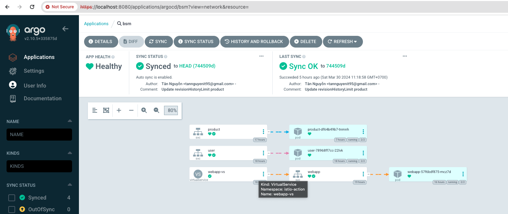

### Start Cluster
```bash
minikube start
```

### Install tool

#### Istio (Service Mesh)
* Install istioctl
```bash
curl -L https://istio.io/downloadIstio | ISTIO_VERSION=1.15.1 sh -
```
* Check version
```bash
istioctl version
```
* Precheck version of istio with k8s cluster
```bash
istioctl x precheck
```
If see bellow text then is OK for next step

> ✔ No issues found when checking the cluster. Istio is safe to install or upgrade!
  To get started, check out https://istio.io/latest/docs/setup/getting-started/

* Run istio with `demo` profile 
```bash
istioctl install --set profile=demo -y
```

### Install Argo CD
> Link: https://argo-cd.readthedocs.io/

* Install on local

```bash
kubectl create namespace argocd
kubectl apply -n argocd -f https://raw.githubusercontent.com/argoproj/argo-cd/stable/manifests/install.yaml
```

* Login to Argo CD 

```bash
kubectl port-forward svc/argocd-server -n argocd 8080:443
```
Open browser at `http://localhost:8080`

> Credential login with username = `admin`, password you will get from bellow command

```bash
kubectl patch svc argocd-server -n argocd -p '{"spec": {"type": "LoadBalancer"}}'
```

### Run project

```bash
kubectl apply -f application.yaml
```



